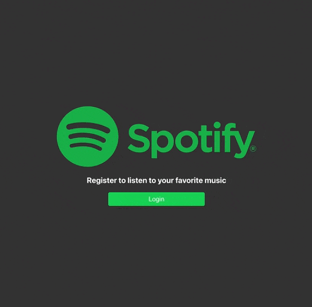

# Spotify playlists generator

Using the public API from Spotify, I've built a playlists generator. So, the user can create playlists based on a song search engine.

## Demo



## Live preview

<https://gentle-genie-83447a.netlify.app>

## Tech Stack

-   React: UI library to build reusable components
-   Typescript: TypeScript is a superset of JavaScript that prevents you from making errors and capture bugs in your code
-   Router: routing library for React
-   Styled components: CSS in JS
-   CRACO: Create react app extra configs

## Features

-   Login with spotify
-   Playlist creating
-   Song search
-   Playlist CRUD

## Installation

### Pre-requisites

-   A spotify account is needed to log in
-   Complete the .env.example with your API info

Install my-project with yarn or npm

```bash
  npm install
  npm prepare
  npm run start
```

or

```bash
  yarn install
  yarn prepare
  yarn start
```

## Environment Variables

To run this project, you will need to add the following environment variables to your .env file

`REACT_APP_CLIENT_ID`

`REACT_APP_CLIENT_SECRET`

`REACT_APP_HOST`

## Optimizations

### Linters

The code is constantly being reviewed by ESLINT + PRETTIER to ensure that best practices are applied.

### Husky

Pre-commit hook is run by Husky to avoid committing bad code.
